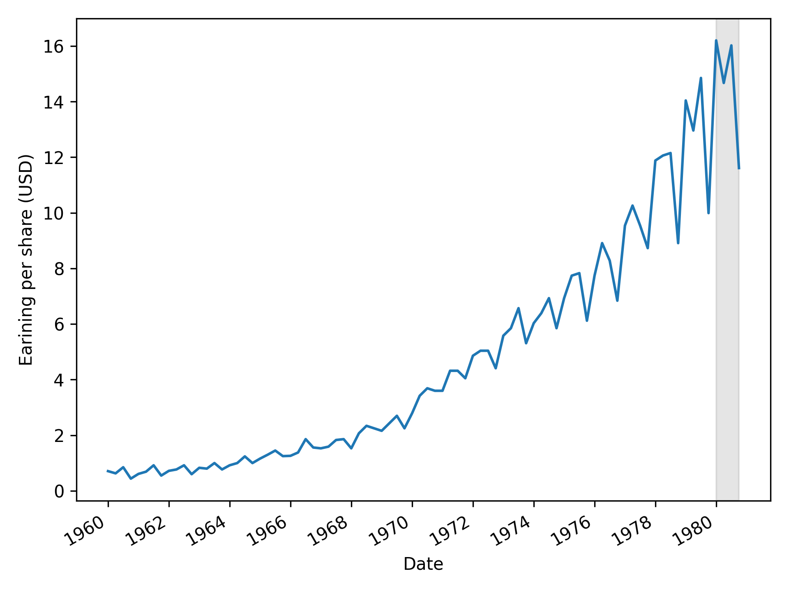
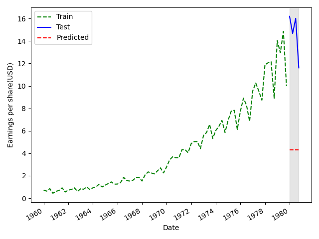
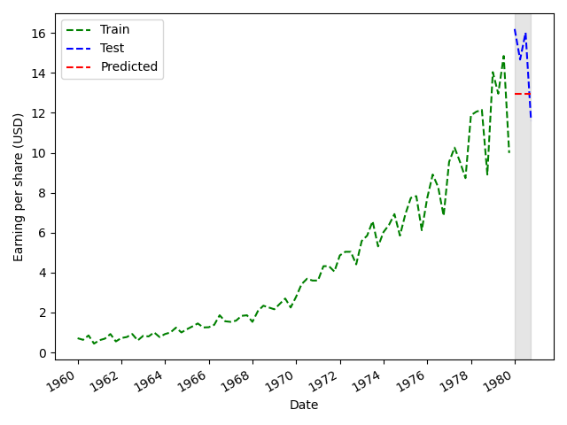
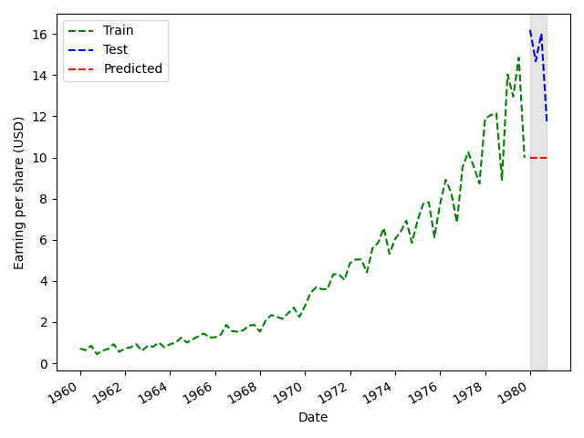
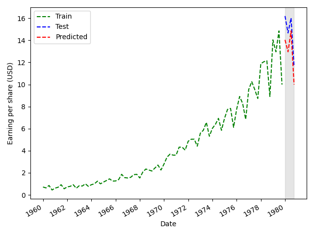

# Naive Prediction

## Overview
This repository contains a Jupyter Notebook, `naive_prediction.ipynb`, that implements a simple naive prediction model. The purpose of this notebook is to demonstrate a basic approach to making predictions with minimal assumptions.

## Data
Data from 1960 to the end of 1979 in order to predict the EPS for the four quarters of 1980.
  

## Forecasting Models
### Forecasting using Historical Mean
Uses the average of past values to predict future outcomes.
  

### Forecasting using Last Year’s Mean
Predicts future values using the mean of the previous year's data.
  

### Forecasting using the Last Known Value
Uses the most recent observed value as the prediction for future periods.
  

### Naive Seasonal Forecast
Predicts future values by repeating the observed values from the previous season.
  

## Comparison of All Baseline Models
Evaluates baseline models using error metric MAPE (Mean Absolute Percentage Error).
  

## Dependencies
To run this notebook, you need the following Python libraries:
- `pandas`
- `numpy`
- `matplotlib`

You can install the required packages using:
```bash
pip install pandas numpy matplotlib
