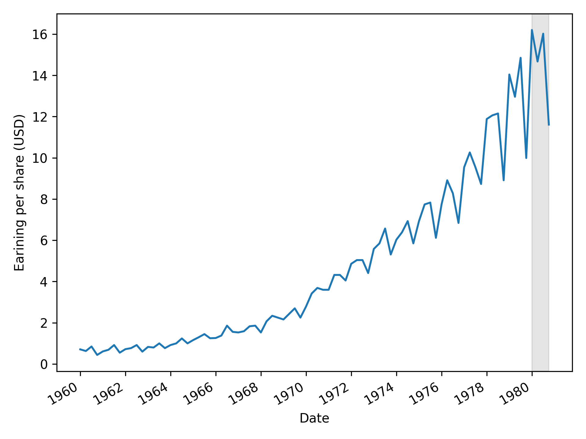
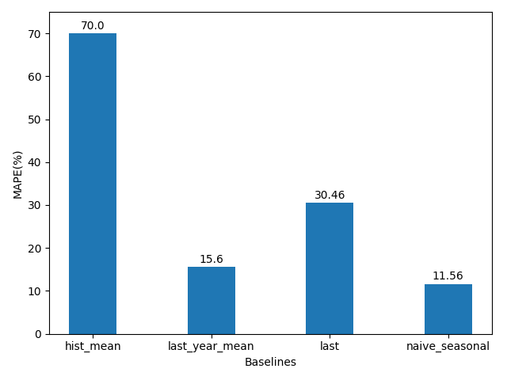

# Time_Series_Forecasting

---

# Naive Prediction

## Dataset
The dataset spans from **1960 to 1979**, and the goal is to predict the **EPS (Earnings Per Share) for the four quarters of 1980**.

## Forecasting Models
### 1. Historical Mean Forecast
This method predicts future values using the average of past observations.

### 2. Last Year's Mean Forecast
This approach uses the mean of the most recent year's data for prediction.

### 3. Last Known Value Forecast
This technique assumes that the most recent observed value will persist into the future.

### 4. Naive Seasonal Forecast
Predicts future values by repeating the observations from the corresponding period in the previous season.

## Model Evaluation: Comparing Forecasting Methods
Baseline models are evaluated using **Mean Absolute Percentage Error (MAPE)** to measure prediction accuracy.

---

# Random Walk Process

A **random walk** is a stochastic process where there is an equal probability of moving up or down by a random value. It is a fundamental concept in time series analysis and plays a significant role in financial markets and econometrics. A random walk is characterized by its first difference being stationary and uncorrelated.

## Stationarity in Time Series: Stationary vs. Non-Stationary Data
A **stationary time series** exhibits statistical properties that remain constant over time. Key characteristics include:
- **Constant mean**: The average value does not change over time.
- **Constant variance**: The fluctuations around the mean remain stable.
- **Constant autocorrelation**: The correlation between lagged values remains unchanged over time.

### Differencing: A Technique for Achieving Stationarity
To convert a non-stationary time series into a stationary one, **differencing** is applied. This technique measures the change between consecutive time steps:

\[ y'(t) = y(t) - y(t-1) \]

- **First-order differencing**: Computing the difference once.
- **Second-order differencing**: Computing the difference twice to remove more complex trends.

### Mean Behavior in Stationary vs. Non-Stationary Series

### Variance in Stationary vs. Non-Stationary Series

## The Autocorrelation Function (ACF)
- **Correlation** measures the strength of a linear relationship between two variables.
- **Autocorrelation** quantifies the relationship between lagged values within a time series.
- **Lag** refers to the number of time steps separating two observations.
- **ACF Interpretation**:
  - In a trending series, ACF values decrease linearly as lag increases.
  - In a seasonal series, ACF exhibits repeating cyclical patterns.

## Impact of Differencing on a Random Walk
Differencing helps eliminate trends, making a series stationary.

## Autocorrelation of a Differenced Random Walk
After differencing, the autocorrelation behavior of the series changes significantly.

## Case Study: Google Stock Price Dataset
Analyzing stock prices often reveals a random walk behavior, making forecasting a challenging task.

## Autocorrelation Analysis of the First-Differenced Dataset
The autocorrelation function after differencing helps determine whether the series has become stationary.

## Splitting the Data: Train and Test Sets
For predictive modeling, the dataset is divided into training and testing sets.

## Forecasting Techniques: Mean, Last Value, and Drift Method
Common forecasting approaches include:
- **Mean method**: Predicting future values based on the historical mean.
- **Last value method**: Assuming the most recent observation persists.
- **Drift method**: Accounting for trends over time.

## Evaluating Forecast Performance: Mean Squared Error (MSE)
The **Mean Squared Error (MSE)** quantifies the accuracy of different forecasting methods.

---
