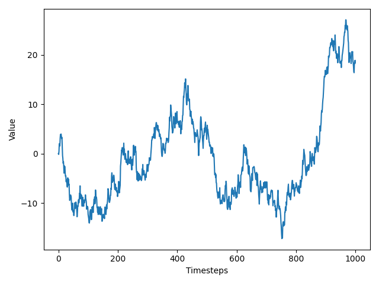
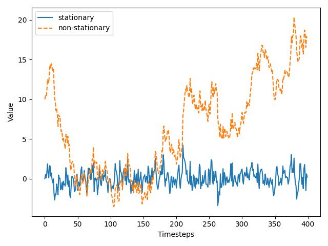
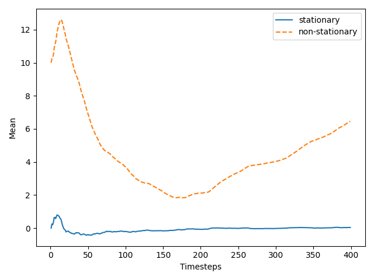
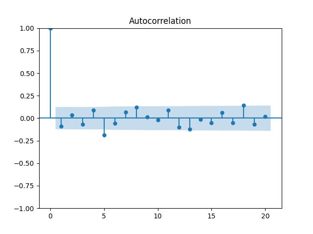
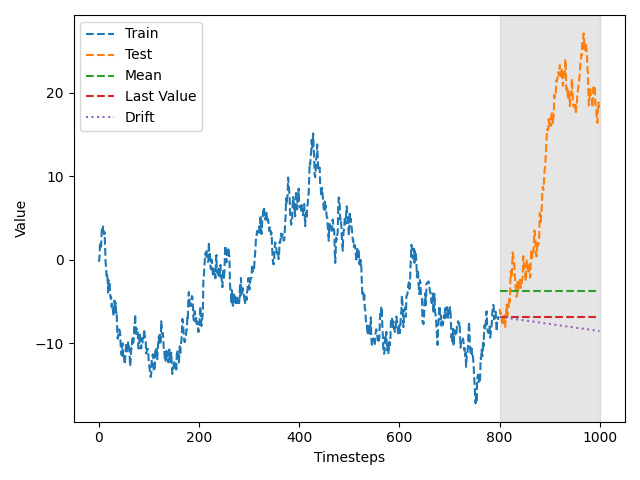

# Random Walk Process

A **random walk** is a process in which there is an equal chance of moving up or down by a random number. A random walk is a series whose first difference is stationary and uncorrelated.

## Stationary vs Non-Stationary
A **stationary** time series is one whose statistical properties do not change over time. It has:
- Constant mean
- Constant variance
- Constant autocorrelation (independent of time)

### Differencing
**Differencing** is a transformation that calculates the change from one timestep to another:

\[ y'(t) = y(t) - y(t-1) \]

- **First-order differencing:** Taking the difference once.
- **Second-order differencing:** Taking the difference twice.

### 2.1 Mean Graph of Stationary vs Non-Stationary

### 2.2 Variance of Stationary vs Non-Stationary

## The Autocorrelation Function
- **Correlation** measures the extent of a linear relationship between two variables.
- **Autocorrelation** measures the linear relationship between lagged values of a time series.
- **Lag** refers to the number of timesteps separating two values.
- **ACF plot**: 
  - In a trending series, ACF coefficients decrease linearly with increasing lag.
  - In a seasonal series, ACF shows periodic patterns.

## Differenced Random Walk

## Autocorrelation for Above

## Google Stock Price Dataset

## Autocorrelation of the First Difference of Dataset

## Train and Test Set

## Prediction Using Mean, Last Value, and Drift Method

## MSE Squared Loss of Above Methods

